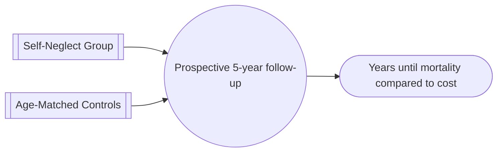
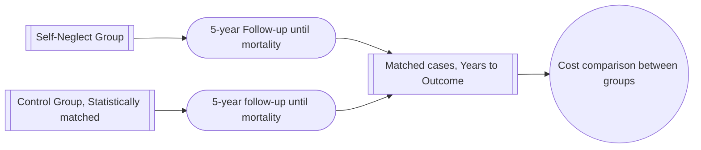

---
aliases:
source:
authors: franzini, dyer
year-pub: 2008
tag: research
---

# [Franzini L, Dyer CB. Healthcare costs and utilization of vulnerable elderly people reported to Adult Protective Services for self-neglect. J Am Geriatr Soc 2008;56(4):667–76.](https://sciwheel.com/fulltext/doi/10.1111/j.1532-5415.2007.01629.x)

> [!Hypothesis]
> "...before referral, healthcare utilization and costs would be lower for cases than controls and that, after referral and engagement in the healthcare system, utilization and costs for cases would be higher than for controls because of previously unmet need."

## Patients

Patients were referred to the *Texas Elder Abuse and Mistreatment* (TEAM) Team from the *Adult Protection Service* in cases of complexity warranting a geriatric/multidisciplinary team involvement. Generally when such patients displayed some of:
- questionable decision-making
- reluctance to leave their homes
- lack of medical care for prolonged time
- unable to see their own physicians
- possible underdiagnosis/polypharmacy/inadequate care

These patients were recruited from a single region of Texas which included the Houston metropolitan area.

The patients in this study were referred in the years 2002 and 2003, and were over 65 years of age and had allegations of self-neglect.

%% 
[P:: Included patients were referred to a multidisciplinary team for complexity, by the Texas APS team, with allegations of self-neglect, and over the age of 65]

[N:: 131]

%% 

## Intervention 

Data collected for each patient were:
- Primary diagnosis as per ICD-9 code
- Measure of health-care utilisation, including house calls, hospital stay, length of stay
- Intensity of care as per *History, Exam, and Complexity of Management (HEM)* codes
- Healthcare costs measured as Medicare reimbursable calculations, as measured by DRG codes, RVU, etc. before referral to TEAM and after

%% 
[I:: ICD-9 code of Primary Diagnosis]
[I:: Intensity of care]
[I:: Healthcare costs calculated as medicare reimbursable rate]

%%

## Control  

Controls were selected from patients of the same TEAM's care, matched for sex, race or ethnicity, and age.

This was modified in cases where age-matched controls could not be identified to satisfy the other criteria.

%% 
[C:: Controls were recruited from the Geriatrics program of Harris County Hospital, matching, sex, ethnicity, and *generally* to age]

%%

## Outcome  

Primary outcomes presented were:
- Median age of 78 
- Ethnicity breakdown:
	- 72 black patients
	- 5 hispanic
	- 54 white
- Most common diagnosis *differences* between the self-neglect patients and controls were
	- Mental disorder, 15% compared to 3%
	- Alzheimers disease, 3% compared to 0.9%
- Most common similar diagnoses were
	- Circulatory system, 27% and 25%
	- Symtpoms and ill-defined condition, 12% and 13%
	- Endocrine, nutriotiona, nad metabolic disease, 10% and 11%
	- Disease of the musculoskeletal system, 8% and 6%
- Length of stay, before and after referral
	- Self-neglect 1.17 days to 5.54 days
	- Controls 4.07 days to 4.87%
- Utilisation of medical services before and after

|Medical Service|Self-Neglect ||Control ||
|---|---|---|---|---|
|Percent of Patients with service|Before|After|Before|After|
|Outpatient|18%|48%|63%|63%|
|Assisted Living|0%|0%|4%|2%|
|Number of Services|36%|92%|85%|88%|
|House Calls|3%|27%|8%|16%|

- Medicare reimbursements were non-significantly lower in the self-neglect group than control groups
	- however this difference was significant in the year preceding recruitment

%% 
[O:: Mean age of 78, preponderence of black patients]
[O:: Mental disorder and Alzheimers dementia were more common among self-neglect patients]
[O:: Overall self-neglect patients were under utilisers of medical services in the year prior to referral]
[O:: The only significant difference in utilisation of services after referral was for house calls amongst self-neglect patients]
[O:: Health-care costs were non-significantly lower in self-neglect patients after referral, and significantly lower before referral]

%%

## Conclusion  

This study confirmed the authors hypothesis that patients with self-neglect had generally less health-care cost, which is attributed to low utilisation of health-services.

However, despite this self-neglect these patients did not end up with a higher utilisation of services, and hence did not incur higher costs, after assessment by and MDT geriatrics team.

However, self-neglect patients clearly represented a greater complexity of medical care at the time of this referral, although I can realisitically only infer this as DRG codes are not presented in the date (I don't think). This complexity in Medicare reimbursements would in theory increase the cost of self-neglect patients *if they were recieving the same amount of care* as control patients.

The fact we don't see this suggests there remains an underutilisation of health-care resources, and with the exception of house-calls, we see this non-significant difference in the date presented. It could also be argued that this increased use of house-calls - here described in a way that suggests provider-initiated service - indicates that such patients continue to self-neglect and under-utilise services available

%%
[comment:: I question the vailidity of this study's conclusions as there appears to be a mismatch in complexity of these patients, and the level of services that they utilise]
%%


## Comments and Extracts

An interesting alternative to this data would be to look at some sort of *outcome-associated cost*, ie. how much does it cost to bring up the self-neglect group to a similar medical outcome. Which would be difficult data to collect, and then to analyse.



An alternative could be:


***
%% BIBTEX Data %%

```
@article{franzini_2008,
title = {Healthcare costs and utilization of vulnerable elderly people reported to Adult Protective Services for self-neglect.},
author = {Franzini, Luisa and Dyer, Carmel Bitondo},
pages = {667-676},
url = {http://dx.doi.org/10.1111/j.1532-5415.2007.01629.x},
year = {2008},
month = {apr},
urldate = {2022-09-12},
journal = {Journal of the American Geriatrics Society},
volume = {56},
number = {4},
doi = {10.1111/j.1532-5415.2007.01629.x},
pmid = {18284533},
keywords = {geriatrics},
sciwheel-projects = {Journal Club},
abstract = {{OBJECTIVES}: To assess differences between diagnoses, healthcare utilization, and healthcare costs of vulnerable elderly people reported to Adult Protective Services for self-neglect and those of matched controls. {DESIGN}: A case-control study of 131 self-neglect cases and 131 matched controls. {SETTING}: All participants were patients in a public hospital geriatrics program. {PARTICIPANTS}: Adult Protection Services referred the self-neglect cases to an interdisciplinary geriatric medicine team. The controls were patients who used the same source of geriatric medical services and were matched on race or ethnicity, sex, and age. {MEASUREMENTS}: Diagnoses, healthcare utilization, and Medicare reimbursable costs were compared in cases and controls for 1 year before and 1 year after the case medical referral. {RESULTS}: Mental disorders were diagnosed more frequently in the self-neglect group than in the control group. Self-neglecters had lower healthcare utilization and medical costs than controls in the year before the medical referral, but utilization and costs were similar in the two groups in the year after the referral. {CONCLUSION}: This study provides evidence that, once self-neglecters are brought into the healthcare system, they are no more expensive than other similar patients. This result has important public policy implications and fills an important gap, because there is no published literature describing the financial effect of self-neglect on the healthcare system.}
}

```
