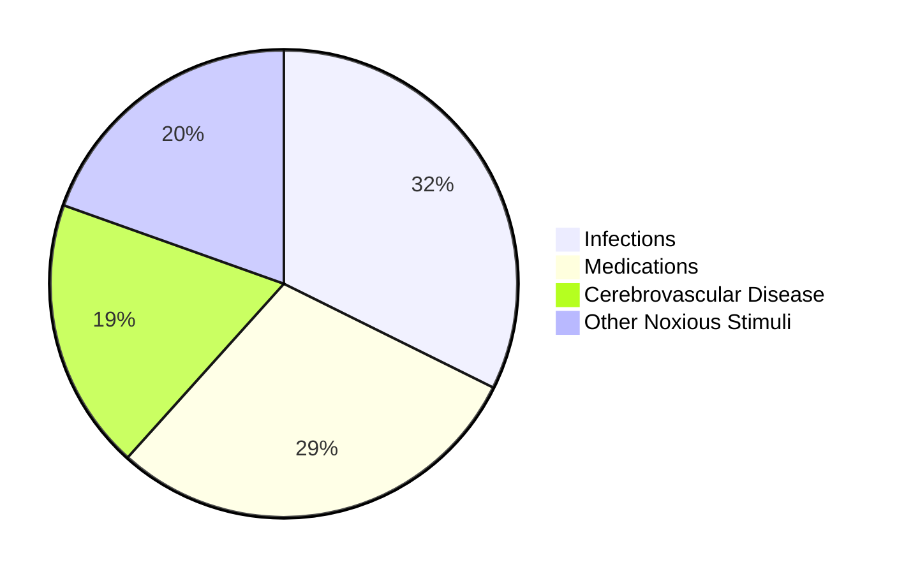
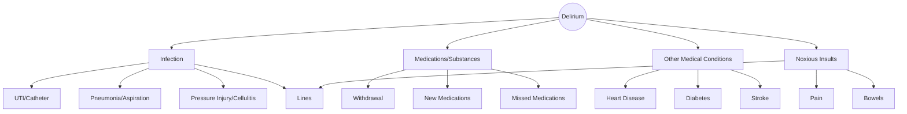

# Delirium 
## and its Malcontents

---

### What is Delirium?

1. Definitions
3. Pathophysiology
4. Clinical Recognition
5. Prevention and Treatment
6. Clinical Example

---

>  Acute Brain Failure

---

### *delirare*: crazy or to rave

Delirium is a **syndrome** of an acute confusional state, that has a wide range of heterogenous **pathologies**. 

---

### DSM-5 Criteria [^ref-dsm]

1. Disturbance in attention and awareness develops acutely and tends to fluctuate in severity.
2. At least one additional disturbance in cognition
3. Disturbances are not better explained by pre-existing dementia.
4. Disturbances do not occur in the context of a severely reduced level of arousal or coma.
5. Evidence of an underlying organic cause or causes

---

## Cardinal Features

- Attentional Deficits
- Disorganised Thinking
- Altered Level of Consciousness
- Disturbance in Perception
- Altered Sleep-Wake Cycle

---

### Delirium &ne; Dementia

- Neurodegenerative and Psychiatric disorders may mimic delirium and *visa versa*.
- Delirium may *unmask* more chronic underlying disorders.

%%
There is also some talk about BPSD actually being more of a delirium syndrome than a part of Dementia
%%

---

![[Delirium-table.jpg]]

---

> Delirium is a potential indicator of a life-threatening illness, and every episode of delirium should be appropriately evaluated. [^ref-del]

---

## What, Why, and Who is Delirium?

> "...represents the clinical manifestation of diffuse, non-specific neuropsychiatric manifestation of a generalised disorder of cerebral oxidative metabolism and neurotransmission." [^saxena]

---

> Delirium is **precipitated** by various causes on **predisposed** patients

---

### Predisposing Risk Factors

- Elderly, &ge; 65 years old 
- Impaired baseline cognition
- Frailty
- Visual or hearing impairment
- Medical Commorbidity
- Polypharmacy and substance use
- Disturbed sleep

---

### Precipitant causes are non-exclusive

> delirium is typically multifactorial with multiple pathologies present

---

![[precip.jpg]]

%%
- *Infections*  UTI, Cellulitis, pressure injury, pneumonia, Aspiration, lines infections
- *Medications* Missed meds, new meds, withdrawal syndromes 
- *Commorbidities* Gout flares, heart disease, diabetes, hypoglycaemia
- *Noxious Stimuli* Pain, constipation, lines, devices
%%

---

%%

---
%%

> *Delirium* is an oft unrecognised condition that confers significant morbidity and mortality

---

## High Risk Patients

- Elderly, Unwell, and Frail

> up to a 24% of older adults will have delirium on admission 
> up to 60% post-operatively
> as high as 87% in an ICU setting  

---

## Is this patient delirious?

1. Is this an acute change?
3. Are they having trouble following conversations?
4. Are they forgetting things?
5. Is there an altered level of consciousness?
6. Is there family concerns?

---

## Delirium Screening Tools

|CAM||4AT|
|---|---|---|
|Acute change in Mental Satus||Alert?|
|Inattention||Orientated?|
|Disorganised||Focused?|
|Altered Level of Consciousness||Acute?|

---

## Delirium Paradigms

1. Hyperactive: agitated, wandering, delusions and hallucinations 
2. Hypoactive: decreased arousal 
3. Mixed: fluctuating between other subtypes (*most common*)

---

### Searching for a Cause

- Are they unwell?
- Medication changes?
- Eating and drinking?
- Bowels opening?
- Has there been a fall?
- Are they in pain? 

---

> Treatment begins with preventing delirium in the first place

---

### Ensure that predisposing factors are managed...

- Spectacles and hearing aids provided
- Orientated with signage, clocks, calenders  
- Eating and drinking 
- Avoid sedation, constipation, pressure injuries  
- Avoid lines and devices where possible
- Ensure sleep hygiene  

---

### ...And precipitating causes are addressed  

- Avoid polypharamacy 
- Ensure antibiotics are given where prescribed
- Treat any drug withdrawal  

---

![[prevention.jpg]]

---

## Antipsychotics and Sedation?

> Should be avoided. But may be necessary for staff and patient safety.

- May prolong a delirium 
- Lead to falls
- Disturb sleep-wake cycle
- Impair engagement in physical therapy  

---

# What is Delirium?

> ...is *acute* brain failure heralding a *serious medical* condition, and is a result of often multiple *precipitant* factors, on a *predisposed* patient.

---

> [!case study]
> 78M with L MCA stroke
> Presenting with dysarthria, aphasia, and right UL weakness
> Aetiology: cardioembolic 
> Risk Factors: new AF, HFrEF, T2DM 
> Social: mRS 3, from ILU, 4WW  

What are the predisposing factors in this case?

---

> [!day 2]
> deterioration overnight, febrile, increased wob 
> likely aspiration event 
> drowsy 
> 
> Plan: nbm pending SP r/v, IV ab, sit upright   

What potential precipitating factors are present? 

---

 [^ref-del]:  ![[StatPearls-Delirium#^ref]] 
[^ref-nursing]: ![[StatPearls-Delirium-Nursing#^ref]]
[^ref-dsm]: ![[DSM-5#^ref]]
[^saxena]: ![[Delirium-in-the-elderly_a-clinical-review#^ref]]
[^help]: ![[Hospital-Elder-Life-Program#^ref]]